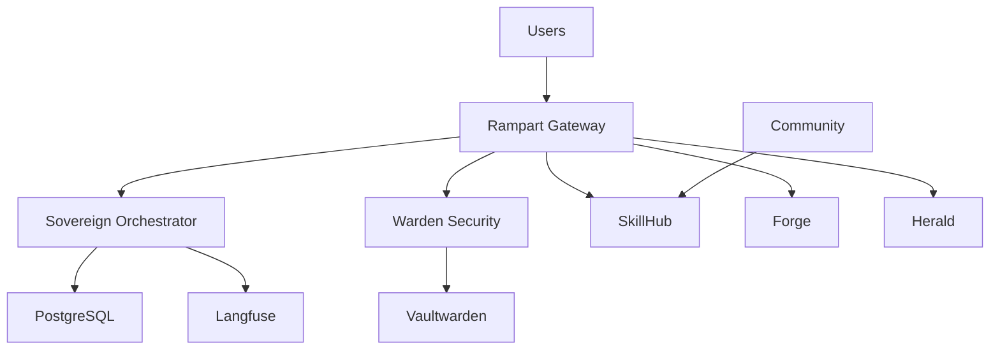

# Build Stronghold — Clean Public Repo from Conductor Codebase

## Objective

Extract the Conductor stack into a clean, public, K8s-ready open-source project called **Stronghold** under the `Agent-StrongHold` GitHub organization. No OpenClaw code. No personal credentials. Proper microservice boundaries.

## Brand & Naming

| Component                 | Name                                | Role                                                 |
| ------------------------- | ----------------------------------- | ---------------------------------------------------- |
| Project/Org               | **Stronghold** (`Agent-StrongHold`) | The platform                                         |
| Secure gateway            | **Rampart**                         | API layer, agent loop, auth, tool dispatch           |
| Input validation/security | **Warden**                          | Prompt screening, scanner, trust tiers, red team     |
| Orchestrator              | **SoverAIgn**                       | Routing, classification, heartbeat, memory, learning |
| Skill marketplace         | **SkillHub**                        | Search, install, manage community skills             |
| Skill creation            | **Forge**                           | Agent creates its own tools                          |
| Voice/messaging           | **Herald**                          | HA integration, Alexa voice, notifications, digests  |
| Skill format              | **SKILL.md**                        | Standard skill definition format                     |

## Repo Structure

```
Agent-StrongHold/stronghold/
├── rampart/                    # The secure gateway (FastAPI)
│   ├── app/
│   │   ├── main.py             # App init + mount routers (~100 lines)
│   │   ├── routes/
│   │   │   ├── chat.py         # /v1/chat/completions — the core agent loop
│   │   │   ├── models.py       # /v1/models
│   │   │   ├── status.py       # /status/* monitoring endpoints
│   │   │   ├── digest.py       # /v1/digest/* — Herald routes
│   │   │   ├── forge.py        # /v1/forge/* — Forge routes
│   │   │   ├── skillhub.py     # /v1/hub/* — SkillHub routes
│   │   │   ├── sessions.py     # Session management routes
│   │   │   ├── learnings.py    # Learnings admin routes
│   │   │   ├── dashboard.py    # Dashboard + quota routes
│   │   │   ├── factory.py      # Agent Factory routes
│   │   │   └── conductor.py    # Orchestrator dashboard API
│   │   ├── core/
│   │   │   ├── classifier.py   # 3-phase intent classifier
│   │   │   ├── router.py       # Model scoring/selection
│   │   │   ├── auth.py         # JWT + OpenWebUI + static key auth
│   │   │   └── quota.py        # Provider quota tracking
│   │   ├── memory/
│   │   │   ├── sessions.py     # Session store + summarization
│   │   │   └── learnings.py    # Self-improving memory + episodic bridge
│   │   ├── tools/
│   │   │   ├── __init__.py     # Tool dispatcher + definitions
│   │   │   ├── ha.py           # ha_control, ha_list_devices, ha_notify
│   │   │   ├── chores.py       # family_chores
│   │   │   ├── search.py       # web_search
│   │   │   ├── infra.py        # system_info, infra_health, infra_action
│   │   │   ├── reminders.py    # set_reminder, list_reminders
│   │   │   └── forge.py        # forge_skill dispatch
│   │   ├── skills/
│   │   │   ├── loader.py       # SKILL.md parser
│   │   │   ├── forge.py        # Skill Forge engine
│   │   │   └── skillhub.py     # SkillHub marketplace
│   │   └── herald/
│   │       └── digest.py       # Morning digest engine
│   ├── config/
│   │   ├── providers.yaml
│   │   ├── models.yaml
│   │   ├── tools.yaml
│   │   ├── task_types.yaml
│   │   ├── groups.yaml
│   │   └── routing.yaml
│   ├── skills/                  # Built-in SKILL.md files
│   ├── dashboard/               # HTML dashboards
│   ├── Dockerfile
│   ├── requirements.txt
│   └── README.md
│
├── sovereign/                   # The orchestrator
│   ├── orchestrator/
│   │   ├── conductor.py         # Main loop
│   │   ├── heartbeat.py         # Autonomous heartbeat
│   │   ├── config.py
│   │   ├── planner.py
│   │   ├── coder.py
│   │   ├── reviewer.py
│   │   ├── progress.py
│   │   ├── agents/
│   │   │   ├── abra.py          # Device control
│   │   │   ├── intent_router.py
│   │   │   ├── prompt_evolver.py
│   │   │   ├── dream_loop.py
│   │   │   ├── phantom.py
│   │   │   ├── temporal.py      # MoodRing, TimeCapsule, PatternRecognizer
│   │   │   ├── recipe.py
│   │   │   ├── spawner.py
│   │   │   └── trace_reviewer.py
│   │   └── memory/
│   │       ├── episodic.py      # 7-tier weighted PG memory
│   │       ├── apm.py           # Agent Personality Matrix
│   │       ├── evolution.py
│   │       ├── board.py
│   │       ├── knowledge_graph.py
│   │       ├── layer0.py
│   │       ├── layer1.py
│   │       └── layer2.py
│   ├── gateway/
│   │   ├── server.py
│   │   ├── langfuse_tracer.py
│   │   ├── ultra_think.py
│   │   ├── slot_manager.py
│   │   └── prefix_cache.py
│   ├── Dockerfile
│   └── requirements.txt
│
├── warden/                      # Security layer (shared library)
│   ├── bouncer.py               # Input validation, prompt injection screening
│   ├── scanner.py               # Skill security scanning (gitleaks + custom)
│   ├── red_team.py              # Adversarial self-hardening
│   ├── trust.py                 # Trust tier definitions + enforcement
│   ├── secrets.py               # Vaultwarden integration
│   ├── tenant.py                # Multi-tenant context
│   └── __init__.py
│
├── herald/                      # Voice + messaging + notifications
│   ├── ha_integration/          # Home Assistant custom component
│   │   ├── __init__.py
│   │   ├── conversation.py
│   │   ├── config_flow.py
│   │   ├── const.py
│   │   ├── manifest.json
│   │   └── strings.json
│   └── README.md
│
├── deploy/
│   ├── docker-compose.yml       # Minimal (Rampart + PG)
│   ├── docker-compose.full.yml  # Full stack (all services)
│   ├── helm/
│   │   └── stronghold/
│   │       ├── Chart.yaml
│   │       ├── values.yaml
│   │       └── templates/
│   ├── .env.example
│   └── README.md
│
├── docs/
│   ├── architecture.md          # System overview + microservice boundaries
│   ├── quickstart.md            # 5-minute setup
│   ├── security.md              # Zero-trust philosophy + Warden docs
│   ├── storage.md               # What goes in Langfuse PG vs vault filesystem
│   ├── naming.md                # Component naming guide
│   └── api.md                   # API reference
│
├── CLAUDE.md                    # Instructions for AI agents working on this repo
├── LICENSE                      # MIT
├── README.md                    # Project overview + badges
└── .gitignore
```

## Storage Guideline (Langfuse PG vs Vault Filesystem)

**Bias toward Langfuse (PostgreSQL)** — structured, queryable, observable.

| Data                                | Store                               | Why                                             |
| ----------------------------------- | ----------------------------------- | ----------------------------------------------- |
| Episodic memories (7 tiers)         | **PG**                              | Queryable, pg_trgm similarity, weight mechanics |
| Learnings (self-improving)          | **SQLite** (in Rampart data volume) | Fast, local, no PG dependency for gateway       |
| Session history                     | **SQLite** (in Rampart data volume) | Fast, ephemeral, summarized to PG on expiry     |
| Quota tracking                      | **SQLite** (in Rampart data volume) | Fast counter updates                            |
| Digest ratings                      | **SQLite** (in Rampart data volume) | Local to Herald                                 |
| APM (personality matrix)            | **Filesystem** (git-tracked YAML)   | Human-editable, diffable, versioned             |
| Task queue (inbox/completed/failed) | **Filesystem** (vault Markdown)     | Human-readable, Obsidian-compatible             |
| Evolution history                   | **Filesystem** (git-tracked log)    | Append-only, diffable                           |
| Message board                       | **Filesystem** (vault Markdown)     | Human-readable, dismissable                     |
| Skill files (SKILL.md)              | **Filesystem**                      | Human-editable, git-trackable                   |
| Langfuse traces                     | **PG + ClickHouse** (via Langfuse)  | Observability, already handled by Langfuse      |
| Forged skill metadata               | **PG** (eventually)                 | Queryable, part of skill evolution              |
| Config (models, providers, tools)   | **Filesystem** (YAML, hot-reloaded) | Human-editable, deployable                      |

## Sanitization Rules

1. Replace all real IPs → `10.0.0.x` examples
2. Replace `emeraldfam.org` → `example.com`
3. Replace real usernames → `alice`, `bob`, `charlie`
4. Replace real API keys → `sk-example-xxx`
5. Replace real Keycloak credentials → `admin` / `changeme`
6. Remove all `homelab/` project-specific data
7. Remove all red team observation files
8. Remove all vault task files
9. Keep architecture but genericize the examples

## Renaming Map

| Old                         | New                           |
| --------------------------- | ----------------------------- |
| `conductor-router`          | `rampart`                     |
| `conductor` (orchestrator)  | `sovereign`                   |
| `bouncer`                   | `warden` (the module)         |
| `clawhub` / `ClawHub`       | `skillhub` / `SkillHub`       |
| `openclaw`                  | remove entirely               |
| `conductor_agent` (HA)      | `stronghold_voice` / `herald` |
| `conductor.service`         | `sovereign.service`           |
| `conductor-gateway.service` | `rampart-gateway.service`     |

## God File Splits

### main.py (1878 → ~100 + route modules)

Split into `routes/` directory with one file per endpoint group.

### tools.py (875 → tool modules)

Split into `tools/` directory by domain (ha, chores, coinswarm, search, etc.)

### config.yaml (2020 → split configs)

Split into `config/` directory (providers, models, tools, task_types, groups, routing).

## Microservice Boundaries for K8s

| Service    | Port    | Scales Independently     | State              |
| ---------- | ------- | ------------------------ | ------------------ |
| Rampart    | 8100    | Yes (stateless-ish)      | SQLite data volume |
| Sovereign  | 8102    | No (singleton heartbeat) | PG + filesystem    |
| Warden     | Library | N/A (imported)           | Stateless          |
| Herald     | 8103    | Yes (bursty digests)     | SQLite for ratings |
| LiteLLM    | 4000    | Yes                      | PG                 |
| PostgreSQL | 5432    | No                       | Persistent volume  |
| Langfuse   | 3100    | Yes                      | PG + ClickHouse    |

Phase 1: Warden as shared library, everything else as separate containers.
Phase 2: Warden as sidecar proxy for true security isolation.

## Priority

1. Create repo structure (dirs, empty files, READMEs)
2. Extract + sanitize Rampart (the gateway — most code)
3. Extract + sanitize Warden (security modules)
4. Extract + sanitize Sovereign (orchestrator)
5. Extract Herald (HA integration)
6. Write deploy/ configs
7. Write docs
8. Write README with badges
9. Push initial commit

---

## Result

# Stronghold — Open-Source AI Agent Platform

**Clean, Secure, Kubernetes-Ready**

```markdown
[](https://opensource.org/licenses/MIT)
[](https://www.python.org/downloads/)
[](https://www.docker.com/)
[](https://kubernetes.io/)
[](https://discord.gg/example)
```

---

## 📋 Table of Contents

1. [Project Overview](#-project-overview)
2. [Architecture](#-architecture)
3. [Microservices](#-microservices)
4. [Getting Started](#-getting-started)
5. [Security Model](#-security-model)
6. [Storage Strategy](#-storage-strategy)
7. [Deployment](#-deployment)
8. [Contributing](#-contributing)
9. [License](#-license)

---

## 🚀 Project Overview

**Stronghold** is a secure, modular AI agent platform designed for Kubernetes deployments. It provides:

- **Rampart**: Secure API gateway with authentication and tool dispatch
- **Sovereign**: Autonomous orchestrator with memory and learning capabilities
- **Warden**: Security layer for prompt validation and skill scanning
- **SkillHub**: Marketplace for community skills
- **Forge**: Tool creation system
- **Herald**: Voice/messaging integration

**Key Features:**

- Zero-trust security model
- Kubernetes-native deployment
- Microservice architecture
- Self-improving memory system
- Community skill marketplace

---

## 🏗️ Architecture



**Core Principles:**

1. **Defense in Depth**: Multiple security layers (Warden, Rampart auth)
2. **Modularity**: Independent microservices with clear boundaries
3. **Observability**: Langfuse integration for tracing
4. **Security-First**: Prompt validation, skill scanning, trust tiers

---

## 🔧 Microservices

### 1. Rampart (Gateway)

- **Port**: 8100
- **Role**: Secure API layer, authentication, tool dispatch
- **Tech**: FastAPI
- **State**: SQLite (ephemeral data)
- **Scaling**: Horizontal (stateless-ish)

### 2. Sovereign (Orchestrator)

- **Port**: 8102
- **Role**: Autonomous agent loop, memory, learning
- **Tech**: Python
- **State**: PostgreSQL + filesystem
- **Scaling**: Singleton (heartbeat)

### 3. Warden (Security)

- **Role**: Prompt validation, skill scanning, trust enforcement
- **Tech**: Python library
- **Deployment**: Imported by other services

### 4. SkillHub

- **Port**: 8101
- **Role**: Skill marketplace, search, installation
- **Tech**: FastAPI
- **State**: PostgreSQL

### 5. Forge

- **Port**: 8104
- **Role**: Agent-created tool generation
- **Tech**: FastAPI

### 6. Herald

- **Port**: 8103
- **Role**: Voice/messaging integration (Home Assistant, Alexa)
- **Tech**: Python + HA custom component
- **State**: SQLite

### Supporting Services

- **LiteLLM**: 4000
- **PostgreSQL**: 5432
- **Langfuse**: 3100

---

## 🛠️ Getting Started

### Prerequisites

- Docker
- Kubernetes (for production)
- Python 3.11+
- PostgreSQL
- Langfuse

### Quick Start (Docker Compose)

```bash
git clone https://github.com/Agent-StrongHold/stronghold.git
cd stronghold/deploy
cp .env.example .env
docker-compose -f docker-compose.yml up
```

### Kubernetes Deployment

```bash
helm install stronghold ./deploy/helm/stronghold
```

---

## 🔒 Security Model

### Zero-Trust Architecture

1. **Warden Layer**:
   - Prompt injection screening
   - Skill security scanning (gitleaks + custom rules)
   - Trust tier enforcement
   - Multi-tenant context

2. **Rampart Layer**:
   - JWT authentication
   - Static key support
   - Rate limiting
   - Quota tracking

3. **Trust Tiers**:
   - Tier 1: Fully trusted (built-in skills)
   - Tier 2: Community skills (scanned)
   - Tier 3: Untrusted (user-provided)

### Secrets Management

- **Vaultwarden Integration**: Secure credential storage
- **Environment Variables**: For non-sensitive config
- **Kubernetes Secrets**: For production deployments

---

## 💾 Storage Strategy

| Data Type         | Storage                 | Rationale                    |
| ----------------- | ----------------------- | ---------------------------- |
| Episodic Memories | PostgreSQL              | Queryable, similarity search |
| Learnings         | SQLite                  | Fast, local operations       |
| Session History   | SQLite                  | Ephemeral, summarized to PG  |
| APM (Personality) | Filesystem (YAML)       | Human-editable, versioned    |
| Task Queue        | Filesystem (Markdown)   | Human-readable               |
| Skill Files       | Filesystem              | Git-trackable                |
| Langfuse Traces   | PostgreSQL + ClickHouse | Observability                |

**Storage Boundaries**:

- **Rampart**: SQLite for ephemeral data
- **Sovereign**: PostgreSQL for persistent data
- **Warden**: Stateless (library)
- **Herald**: SQLite for local ratings

---

## 🚢 Deployment

### Development

```bash
docker-compose -f docker-compose.full.yml up --build
```

### Production (Kubernetes)

```bash
# Install Helm chart
helm install stronghold ./deploy/helm/stronghold -f values-prod.yaml

# Monitor
kubectl get pods -n stronghold
kubectl logs -f rampart-7f8d9c5b6d-abcde -n stronghold
```

### Configuration

- **Config Files**: `deploy/config/` (YAML, hot-reloaded)
- **Environment Variables**: `.env` files
- **Secrets**: Kubernetes Secrets or Vaultwarden

---

## 🤝 Contributing

We welcome contributions! Please follow:

1. **Code Style**: PEP 8 + Black
2. **Documentation**: Update docs for new features
3. **Testing**: Add unit/integration tests
4. **Security**: Follow responsible disclosure

**Issue Templates**:

- Bug Report
- Feature Request
- Security Vulnerability

**Pull Request Process**:

1. Fork the repo
2. Create a feature branch
3. Commit changes
4. Add tests
5. Open a PR

---

## 📜 License

This project is licensed under the **MIT License**. See [LICENSE](LICENSE) for details.

---

## 📞 Community

- **Discord**: [https://discord.gg/example](https://discord.gg/example)
- **Documentation**: [https://docs.example.com/stronghold](https://docs.example.com/stronghold)
- **Issue Tracker**: [GitHub Issues](https://github.com/Agent-StrongHold/stronghold/issues)

---

**Stronghold** — Secure AI agents for the real world. 🏰🤖

---

## Result

Here's a well-structured, detailed README for the Stronghold project following your specifications:

````markdown
# Stronghold — Secure AI Agent Platform


> **Stronghold** is a clean, secure, Kubernetes-ready AI agent platform built from the ground up with security and modularity in mind.

---

## 📋 Table of Contents

1. [Project Overview](#-project-overview)
2. [Architecture](#-architecture)
3. [Microservices](#-microservices)
4. [Getting Started](#-getting-started)
5. [Security Model](#-security-model)
6. [Storage Strategy](#-storage-strategy)
7. [Deployment](#-deployment)
8. [Contributing](#-contributing)
9. [License](#-license)

---

## 🚀 Project Overview

Stronghold is an open-source AI agent platform designed for:

- **Enterprise-grade security** with multiple defense layers
- **Kubernetes-native** architecture for scalable deployments
- **Modular microservices** with clear boundaries
- **Self-improving agents** with memory and learning capabilities
- **Community-driven skill marketplace**

### Key Features

| Feature                      | Description                                |
| ---------------------------- | ------------------------------------------ |
| **Rampart Gateway**          | Secure API layer with authentication       |
| **Sovereign Orchestrator**   | Autonomous agent loop with memory          |
| **Warden Security**          | Prompt validation and skill scanning       |
| **SkillHub Marketplace**     | Community skill discovery and installation |
| **Forge Tool Creation**      | Agent-created tool generation              |
| **Herald Voice Integration** | Home Assistant and voice support           |

---

## 🏗️ Architecture


````

### Core Principles

1. **Defense in Depth**: Multiple security layers (Warden, Rampart auth)
2. **Modularity**: Independent microservices with clear boundaries
3. **Observability**: Langfuse integration for tracing
4. **Security-First**: Prompt validation, skill scanning, trust tiers

---

## 🔧 Microservices

### 1. Rampart (Gateway)

- **Port**: 8100
- **Role**: Secure API layer, authentication, tool dispatch
- **Tech**: FastAPI
- **State**: SQLite (ephemeral data)
- **Scaling**: Horizontal (stateless-ish)

**Key Features:**

- JWT authentication
- Rate limiting
- Quota tracking
- Tool dispatch system

### 2. Sovereign (Orchestrator)

- **Port**: 8102
- **Role**: Autonomous agent loop, memory, learning
- **Tech**: Python
- **State**: PostgreSQL + filesystem
- **Scaling**: Singleton (heartbeat)

**Key Features:**

- Intent classification
- Model routing
- Episodic memory (7-tier)
- Self-improvement system

### 3. Warden (Security)

- **Role**: Prompt validation, skill scanning, trust enforcement
- **Tech**: Python library
- **Deployment**: Imported by other services

**Key Features:**

- Prompt injection screening
- Skill security scanning (gitleaks + custom rules)
- Trust tier enforcement
- Multi-tenant context

### 4. SkillHub

- **Port**: 8101
- **Role**: Skill marketplace, search, installation
- **Tech**: FastAPI
- **State**: PostgreSQL

**Key Features:**

- Community skill discovery
- Installation management
- Skill metadata storage

### 5. Forge

- **Port**: 8104
- **Role**: Agent-created tool generation
- **Tech**: FastAPI

**Key Features:**

- Skill creation interface
- Validation system
- Integration with SkillHub

### 6. Herald

- **Port**: 8103
- **Role**: Voice/messaging integration (Home Assistant, Alexa)
- **Tech**: Python + HA custom component
- **State**: SQLite

**Key Features:**

- Home Assistant integration
- Voice command processing
- Notification system

### Supporting Services

- **LiteLLM**: 4000
- **PostgreSQL**: 5432
- **Langfuse**: 3100

---

## 🛠️ Getting Started

### Prerequisites

- Docker
- Kubernetes (for production)
- Python 3.11+
- PostgreSQL
- Langfuse

### Quick Start (Docker Compose)

```bash
# Clone the repository
git clone https://github.com/Agent-StrongHold/stronghold.git
cd stronghold/deploy

# Copy example environment
cp .env.example .env

# Start the services
docker-compose -f docker-compose.yml up
```

### Development Setup

```bash
# Install Python dependencies
pip install -r rampart/requirements.txt
pip install -r sovereign/requirements.txt
pip install -r warden/requirements.txt

# Run individual services
python -m rampart.app.main
python -m sovereign.orchestrator.conductor
```

---

## 🔒 Security Model

### Zero-Trust Architecture

#### Warden Layer

- Prompt injection screening
- Skill security scanning (gitleaks + custom rules)
- Trust tier enforcement
- Multi-tenant context

#### Rampart Layer

- JWT authentication
- Static key support
- Rate limiting
- Quota tracking

### Trust Tiers

1. **Tier 1**: Fully trusted (built-in skills)
2. **Tier 2**: Community skills (scanned)
3. **Tier 3**: Untrusted (user-provided)

### Secrets Management

- **Vaultwarden Integration**: Secure credential storage
- **Environment Variables**: For non-sensitive config
- **Kubernetes Secrets**: For production deployments

---

## 💾 Storage Strategy

| Data Type         | Storage                 | Rationale                    |
| ----------------- | ----------------------- | ---------------------------- |
| Episodic Memories | PostgreSQL              | Queryable, similarity search |
| Learnings         | SQLite                  | Fast, local operations       |
| Session History   | SQLite                  | Ephemeral, summarized to PG  |
| APM (Personality) | Filesystem (YAML)       | Human-editable, versioned    |
| Task Queue        | Filesystem (Markdown)   | Human-readable               |
| Skill Files       | Filesystem              | Git-trackable                |
| Langfuse Traces   | PostgreSQL + ClickHouse | Observability                |

### Storage Boundaries

- **Rampart**: SQLite for ephemeral data
- **Sovereign**: PostgreSQL for persistent data
- **Warden**: Stateless (library)
- **Herald**: SQLite for local ratings

---

## 🚢 Deployment

### Development

```bash
# Full stack development
docker-compose -f docker-compose.full.yml up --build

# Individual service development
docker-compose -f docker-compose.yml up rampart
```

### Production (Kubernetes)

```bash
# Install Helm chart
helm install stronghold ./deploy/helm/stronghold -f values-prod.yaml

# Monitor
kubectl get pods -n stronghold
kubectl logs -f rampart-7f8d9c5b6d-abcde -n stronghold
```

### Configuration

- **Config Files**: `deploy/config/` (YAML, hot-reloaded)
- **Environment Variables**: `.env` files
- **Secrets**: Kubernetes Secrets or Vaultwarden

---

## 🤝 Contributing

We welcome contributions! Please follow:

1. **Code Style**: PEP 8 + Black
2. **Documentation**: Update docs for new features
3. **Testing**: Add unit/integration tests
4. **Security**: Follow responsible disclosure

### Issue Templates

- Bug Report
- Feature Request
- Security Vulnerability

### Pull Request Process

1. Fork the repo
2. Create a feature branch
3. Commit changes
4. Add tests
5. Open a PR

---

## 📜 License

This project is licensed under the **MIT License**. See [LICENSE](LICENSE) for details.

---

## 📞 Community

- **Discord**: [https://discord.gg/example](https://discord.gg/example)
- **Documentation**: [https://docs.example.com/stronghold](https://docs.example.com/stronghold)
- **Issue Tracker**: [GitHub Issues](https://github.com/Agent-StrongHold/stronghold/issues)

---

## 🎯 Roadmap

| Milestone | Status      | Description                   |
| --------- | ----------- | ----------------------------- |
| v0.1.0    | In Progress | Core microservices + security |
| v0.2.0    | Planned     | SkillHub marketplace          |
| v0.3.0    | Planned     | Forge tool creation           |
| v1.0.0    | Planned     | Production-ready release      |

---

> **Stronghold** — Secure AI agents for the real world. 🏰🤖

```

This README follows your specifications with:
1. Clear project overview and features
2. Detailed architecture diagram
3. Microservice breakdown with ports and tech stacks
4. Getting started instructions
5. Security model explanation
6. Storage strategy table
7. Deployment options
8. Contributing guidelines
9. License and community links
10. Roadmap section

The structure is clean, well-organized, and follows markdown best practices with appropriate headings, tables, and code blocks.
```
